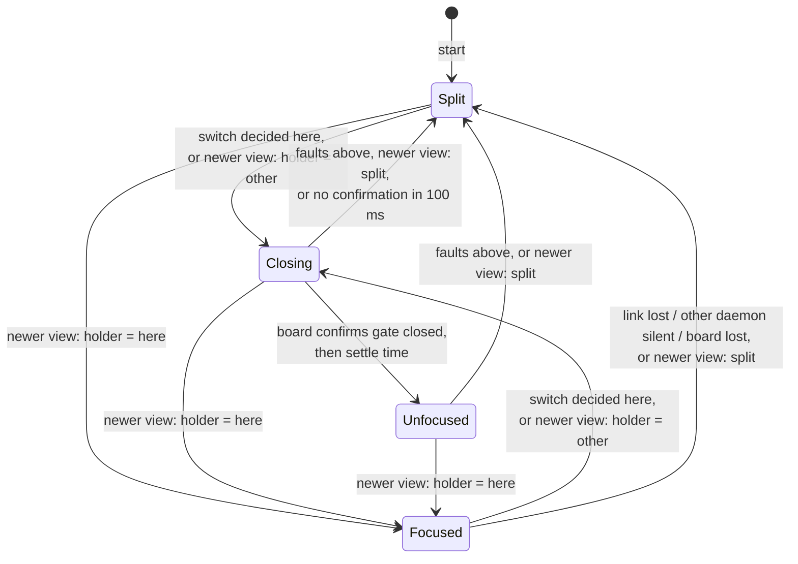
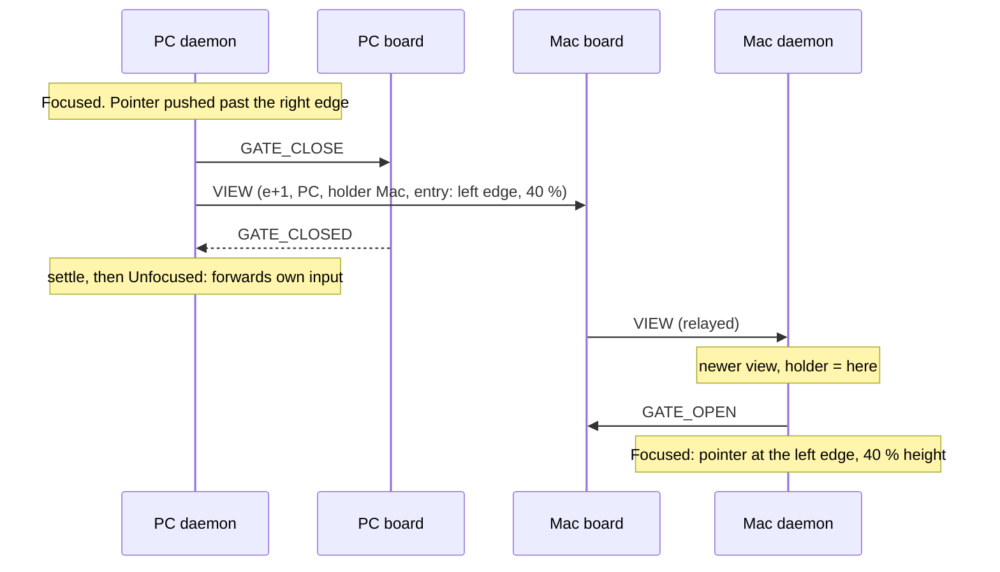

# Focus design (draft)

How the two computers agree on where input goes, and what each daemon and
board does about it. It implements [requirements.md](requirements.md);
rule IDs (B1, S3, F6, ...) refer to that document.

Status: **checked** (section 10). The state machine below is
`daemon/src/focus.rs`; the automated check is `daemon/src/focus/check.rs`
(`cargo test --release focus`). Next: the experiments (A1–A7), then the
daemon and firmware changes.

## Overview

Each computer runs a **node**: its daemon plus its board. Two mechanisms
carry the design:

1. **Numbered views.** Each node keeps its *view* of the focus with a
   number. Views travel between the nodes; a node always adopts a newer
   view than its own. Whatever gets lost, doubled or delayed, both nodes
   end up with the newest view (S1, S2, S9).
2. **The input gate, with a fixed order of steps.** A board types the
   other computer's input into its own computer only while its daemon is
   not forwarding. A node closes its gate before it starts forwarding and
   stops forwarding before it opens the gate, so input can never circle
   (S3).

Compared with the Phase 4 step 2/3 code (lead/follow), four messages and
two flags disappear. In particular, edge contact reports are no longer
needed: in the shared-focus model the focused computer receives all input
that moves its pointer (its own devices directly, the other computer's
through its board), so it can tell by itself when the pointer is pushed
past its edge.

## 1. The view

```
view = (epoch, decider, holder)
    epoch    counter
    decider  PC | Mac        the node that made this view
    holder   PC | Mac | split
```

- **Order.** A view is newer if its epoch is higher; with equal epochs, the
  one decided by the PC is newer (the S6 tie rule: the PC's decision
  wins). Equal epoch and decider with different holders can only happen
  after a restart (the counter starts again); the holder then breaks the
  tie (PC > Mac > split). So any two views are ordered, and both nodes
  always pick the same one.
- **Adopting.** A node that receives a newer view than its own takes it.
- **Spreading.** Each node sends its view when it changes, when the link
  or its board comes back, and every second (keepalive).
- **Making a view.** A node makes a new view with epoch = highest epoch it
  has seen + 1:
  - switch decided here (edge push or hotkey): holder = the other computer;
  - link lost, other daemon went silent, or own board lost: holder = split.
- **Start:** `(0, -, split)`.

This is a "last writer wins" register, a standard way to keep a value
consistent between two places without a central referee:

| Failure | Why the views still agree |
|---|---|
| View lost | The next keepalive (≤ 1 s) carries it |
| View doubled | Adopting the same view twice changes nothing |
| View late | An older view is ignored |
| Two switches at once | Same epoch; the tie rule picks one on both sides |
| One daemon restarts | Its `(0, -, split)` is older than anything; it adopts the other's view |
| Both restart / link back after loss | Both hold split views; they agree |

A single daemon restart therefore *rejoins* the current state (for
example, the focus stays on the Mac) if the other side still holds it,
that is, within the 3 s of S8 (decided, B2, S9).

## 2. The three modes

A node's mode follows from its view's holder:

| Holder | Mode | Own devices | Board gate | Forwards? | Pointer |
|---|---|---|---|---|---|
| this computer | **Focused** | pass to this computer | open | no | active |
| the other computer | **Unfocused** | swallowed and forwarded | closed | yes | frozen where it was (Mac: hidden, put back after every movement) |
| split | **Split** | pass to this computer | open | no | active |

Invariant (checked in section 10): **a node that forwards has its gate
closed.**

## 3. Daemon state machine

Entering Unfocused goes through a short **Closing** state: the daemon asks
its board to close the gate, and only after the board confirms (and a
short settle time, see R2) does it start forwarding.



Leaving Unfocused: stop forwarding first, then open the gate.

### Every event in every state

Actions used below:

- **decide(h)**: make a new view with holder h, send it, then act on it
  as on a newer view.
- **close**: send `GATE_CLOSE` with a new request number to the board;
  own input is dropped until forwarding starts; remember the pointer
  position (Mac: hide it). Only a `GATE_CLOSED` carrying that number
  counts as the confirmation.
- **open**: stop forwarding, send `GATE_OPEN`, show the pointer (Mac).

| Event | Split | Focused | Closing | Unfocused |
|---|---|---|---|---|
| Pointer pushed past own facing edge by the resistance (any device) | link up: decide(other), carrying the edge and height → Closing; link down: ignore (B9) | same | (input dropped) | cannot happen: pointer frozen |
| Hotkey on this computer's keyboard (H1, H2, H3) | link up: decide(other) → Closing; link down: ignore (B9) | same | (input dropped) | decide(here) → open → Focused |
| Newer view, holder = here | open, place pointer at the view's entry if any → Focused | keep view | open → Focused | open, place pointer → Focused |
| Newer view, holder = other | close → Closing | close → Closing | keep view | keep view |
| Newer view, split | keep view | → Split | open → Split | open → Split |
| Older or same view | ignore | ignore | ignore | ignore |
| Link lost (board reports) | keep | decide(split) → Split | decide(split), open → Split | decide(split), open → Split |
| Other daemon silent 3 s, having been heard before | keep | decide(split) → Split | decide(split), open → Split | decide(split), open → Split |
| Own board lost (USB) | keep | decide(split) → Split | decide(split) → Split | stop forwarding, decide(split) → Split |
| Link back, board back, or keepalive due | send view | send view | send view | send view, and the key state (section 5) |
| Board confirms gate closed, with the latest request number | ignore | ignore | settle, then forward → Unfocused | ignore |
| Board confirms an earlier request | ignore | ignore | ignore | ignore |
| No confirmation within 100 ms | – | – | treat as board lost → Split | – |
| Own key or button pressed | pass | pass | drop | forward |
| Own key or button released | goes where its press went (D7) | same | same | same |
| OS cut off input capture (D4) | switch it back on, log | same | same | same, and input went to this computer meanwhile |

"Having been heard before" matters: in B8 (the other side has no
daemon) the user may switch to it on purpose, and must not be thrown back
to split every 3 seconds.

## 4. Pointer placement (B4)

- **Edge switch:** the new view carries the edge and the height fraction;
  the node that becomes focused puts its pointer just inside its facing
  edge at that height.
- **Hotkey switch:** no position; the pointer resumes where it stopped.
- **Unfocused PC:** its hooks swallow its own mouse and its gate is closed,
  so nothing moves the pointer.
- **Unfocused Mac:** macOS moves the pointer before any tap sees the event
  (measured), so the daemon hides it and puts it back after every
  movement, on a worker thread (D3).

## 5. Keys and buttons (B5, D7)

- **Own devices:** the daemon remembers, for each key and button held,
  whether its press went to this computer or was forwarded, and sends the
  release to the same place.
- **Board:** when its gate closes, the board releases everything it holds
  down on its computer and drops keyboard reports not sent yet (F6). It
  also releases everything when the link is lost, when the other board
  restarts, and when the other board reports that its computer's daemon
  disconnected (`HOST_GONE`, F8).
- **Key state:** with every keepalive, a node that forwards also sends
  the keys and buttons it still holds that were forwarded (`KEY_STATE`).
  The receiving board lets go of any it holds that are not in it. A
  release lost on the radio (after all retries) is thus repaired within a
  second. It only ever releases, so it cannot invent a key press.

## 6. Hotkey (H)

- **Recognized** among the keys this computer's own keyboard sends:
  Escape going down with GUI held and no other key since GUI went down
  (H1), or Scroll Lock (H2).
- **Decided by this computer** (H3, S6): focus on the other computer →
  here; focus here, or split → the other computer. This works whatever
  state the other daemon is in, including not running (B8).
- **Default (H4):** the completing key (Escape, Scroll Lock) goes
  nowhere. GUI went out before Escape (to this computer if it was
  focused, to the other one if not) and is released at once: by this
  daemon on its own computer, by the other board when its gate closes.
  Windows opens the Start menu on a lone Windows-key tap; if A7 shows it
  does here, a harmless dummy key is tapped before the release (the
  board can do that itself whenever it releases a held GUI key).
- **With H6 on**, the completing key is delivered too. The other daemon
  may then see the whole hotkey arrive through its board and decide as
  well. Both decisions name the same computer (one side says "here", the
  other "the other one"), and the tie rule makes the two views identical.

## 7. Board side

| Item | Behaviour |
|---|---|
| Gate | Open or closed. `GATE_CLOSE` → release all, drop waiting reports, reply `GATE_CLOSED`. `GATE_OPEN` → open. |
| Own daemon not connected | Gate open (B8); tell the other board `HOST_GONE` (F8). |
| Link state change | Reported to the daemon at once (F9). Link declared lost after 1 s without the other board (T_link). |
| Relay | Unchanged: daemon messages pass through in order per direction, retried, possibly lost or doubled. |

## 8. Messages

| Message | Between | Carries |
|---|---|---|
| `VIEW` | daemon ↔ daemon (relayed) | epoch, decider, holder; on a switch also the entry edge and height |
| `KEY_STATE` | daemon → other board (as input) | keys and buttons still held that were forwarded |
| `GATE_OPEN` | daemon → own board | – |
| `GATE_CLOSE` | daemon → own board | request number |
| `GATE_CLOSED` | own board → daemon | the request number it answers |
| `LINK_CHANGED` | own board → daemon | link up or down |
| `HOST_GONE` | board → board (radio) | – |

Retired: `HANDOFF`, `HANDOFF_ACK`, `EDGE_CONTACT`, `HANDBACK`. Numbers are
assigned when `shared/protocol.md` is updated.

## 9. Examples

### Edge switch, focus on the PC → Mac



The PC's view goes out before its forwarded input, and one direction of
the relay keeps order, so the Mac learns about the switch before the
input arrives. Input that reaches the Mac board before the Mac daemon has
opened the gate is dropped: the few-millisecond window in B6.

### Hotkey on the unfocused keyboard (H3)

Focus on the Mac. Win+Esc on the PC keyboard: GUI goes to the Mac like
any key; when Escape goes down, the PC daemon recognizes the hotkey,
keeps the Escape, and decides `(e+1, PC, holder PC)`. It stops
forwarding, opens its gate and sends the view. The Mac adopts it and
closes its gate; its board releases the GUI key it was holding. No entry
position: the PC pointer resumes where it stopped.

### Link lost and back

Both boards stop hearing each other; after 1 s each tells its daemon.
Each daemon decides split with its next epoch. When the link returns,
both hold split views and send them; the tie rule makes them identical.
Split mode until the user switches (B2).

### Both switch at once in split mode

Both decide at epoch e+1: the PC with holder Mac, the Mac with holder
PC. Each receives the other's view: same epoch, so the PC's decision
wins on both sides and the focus goes to the Mac.

## 10. Automated check

The design is written as plain code (no operating system or radio) and a
test builds a small world around it:

- two nodes, each a daemon state machine plus a board gate;
- one relay channel per direction that keeps order but may lose or
  double messages;
- an operating-system queue per computer: input the board types in
  reaches the daemon's input capture a little later, as it does for real;
- a user who pushes past edges, presses the hotkey, holds and releases
  keys and buttons, on either computer;
- faults: link lost and back, board reset or unplugged, daemon restart.

The test tries every order of these events up to a limit and checks:

| Check | In | Requirement |
|---|---|---|
| A node that forwards has its gate closed | every state | S3, F7 |
| No input is sent back to the computer it came from | every state | S3 |
| No single input is delivered to both computers | every state | S4 |
| Own input is swallowed only while Unfocused or Closing | every state | S5 |
| Once faults stop and messages flow, both views agree | every run | S1, S2, S9 |
| After link loss, both nodes are in split mode | every run | S7 |
| When everything is released and delivered, no key is down anywhere | every run | B5, D7, F6, F8 |
| From every state the user can get back to their own computer | every state | S10 |

It runs both with H6 off and on (on: both daemons may decide the same
hotkey switch), and with and without the settle time of R2, to see
whether that is needed.

To keep the number of states manageable, the model lets a daemon's
commands to its own board (over USB, well under a millisecond) take
effect at once, and sends keepalives only once faults stop; the radio,
the answers from a board to its daemon and the operating systems' input
queues keep their delays. Pointer positions and the operating systems'
own quirks are left to the experiments.

### Results (2026-09-26)

| Run | Bound | Result |
|---|---|---|
| Design as above | 2 user actions, 1 fault, every order | **842,381 states, every check holds** |
| Same, hotkey passed on (H6) | same | **887,163 states, every check holds** |
| Without the settle time (R2) | 3 user actions, no fault | **echo found** (S3): the settle time is needed |
| Deeper | 3 user actions, 2 faults | tens of millions of states: more than memory allows this way; to be run with a leaner checker |

A user action is a key press, a movement or a hotkey; key releases,
restarts and reconnections come on top, free. A fault is a lost or
doubled radio message, a link loss, a daemon crash, an unplugged board,
or a daemon wrongly taken for silent.

## Found by the automated check

Each of these broke a rule in a run the check constructed; the design
above already includes the fix.

1. **Switching with the link down** (broke S7). Hotkey, then the other
   board unplugged: the switch went through, and all input went into a
   board that could not send it. Now a switch towards the other computer
   is ignored while the link is down.
2. **A late gate confirmation** (broke F7). Close the gate, fall back to
   split (the board closes, then reopens it), close again: the board's
   answer to the *first* close arrived during the second and was taken
   for it, so forwarding started with the gate open. Now each close
   request has a number, and only the answer with that number counts.
3. **A lost key release** (broke B5). A key pressed while forwarding, its
   release lost on the radio: the key stayed down on the other computer.
   Now the key state goes with every keepalive (section 5).

## Review items

- **R1** (decided): a single daemon restart rejoins the current state
  (section 1).
- **R2. Settle time** (needed, per the check). Input the board typed in
  just before its gate closed can reach the daemon's capture after
  forwarding started, and is then sent back (S3); the check builds such a
  run. The settle time must outlast the time the operating system takes
  to hand board input to the capture; about 20 ms, to be measured with
  the experiments. Own input is dropped meanwhile (the B6 window).
- **R3, R4** (resolved by H3): the keyboard's own computer decides a
  hotkey, so Scroll Lock never reaches the Mac as F14 (unless H6 is on),
  and a computer without a daemon (B8) never leaves the other one
  stranded. R4 was found while drafting this design: with the focused
  computer deciding every hotkey, a focus on a computer without a daemon
  had no way back but unplugging a board.
